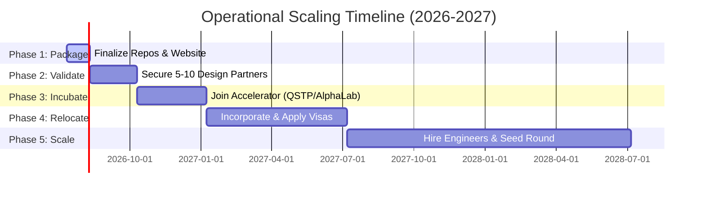

# Zaid Asim Softwares
## Enterprise AI Platforms, Systems Engineering & Zero-Trust Cyber-Defense Envelopes
**Registered Micro-Enterprise:** Government of India (UDYAM-KR-15-0069715)  
**Established:** 2021  
**Founder & Lead Architect:** Zaid Asim (16 Years Old)  
**Current Active Project:** [API Time Machine (ATM)](projects/atm.html)  

---

## 🚀 Company Overview & Vision
Zaid Asim Softwares is a registered micro-enterprise dedicated to building high-performance systems, intelligent cognitive agent fabrics, and active security wrappers for legacy corporate infrastructure. Established in 2021 as a solo-founder venture by Zaid Asim, the studio has designed, built, and shipped over 12 projects across systems engineering, artificial intelligence, and interactive software. 

Our core philosophy is **non-invasive modernization**: providing modern, Zero-Trust security and cognitive capabilities to legacy systems without risking database downtime, compiler breakages, or millions in manual codebase rewrites.

---

## 🛠️ Flagship Product: API Time Machine (ATM)
The **API Time Machine** is an active, edge-deployed cyber-defense wrapper that automatically reverse-engineers legacy binary protocols and compiles real-time protection filters.

### The Problem We Solve
Over 70% of global enterprise transactions still touch a mainframe or legacy database running obsolete, plaintext binary protocols (e.g., custom ISO 8583 implementations, serial SCADA streams, obsolete banking switches). 
*   **Documentation Debt:** The original engineers are gone, and specification documents are lost.
*   **Security Liability:** These protocols transmit sensitive data (e.g., Credit Card PANs, API keys) in plaintext, violating modern security regulations like PCI-DSS 4.0 and GDPR.
*   **The Rewrite Trap:** Rewriting mainframe code is a multi-million dollar venture with high operational risk.

### The ATM Solution
ATM listens to network traffic (via PCAP files or live interfaces), reconstructs the protocol's state machine, generates documentation, and compiles a WebAssembly (WASM) filter deployed directly on an edge proxy (Envoy).

```
[Legacy Client] ---> ( Envoy Proxy + WASM Filter ) ---> [Legacy Mainframe]
                            ^
                            | (WASM Compilation)
                     [Markov Chain DFA] ---> [Kaitai Struct YAML Schema]
                            ^
                            | (Ingest PCAP)
                     [Network Traffic]
```

---

## 🧠 Core Technologies & Algorithms of ATM

### 1. Packet Clustering & Jaccard Similarity
Incoming binary payloads are grouped by structural characteristics (direction, packet length, hex prefixes, and byte distribution) using Jaccard Similarity:
$$J(A, B) = \frac{|A \cap B|}{|A \cup B|}$$

### 2. Markov-Chain DFA State Inference
Chronological packet transitions are tracked to compute transition probabilities:
$$P(X_n = j \mid X_{n-1} = i)$$
These paths form a Deterministic Finite Automaton (DFA) representing the conversation states of the custom protocol.

### 3. Kaitai Struct PDL Generation
The state machine is compiled into a declarative [Kaitai Struct](https://kaitai.io/) Protocol Description Language (PDL) YAML file. This schema acts as the lost documentation of the protocol.

### 4. Rust-Envoy WASM Compilation
The Kaitai schema is parsed by our build engine to compile a Rust-based WebAssembly filter. When deployed to an Envoy proxy, this filter inspects every payload in real time, drops invalid transitions, and masks plaintext PII before it exits the local network.

---

## 🔒 Security Hardening & Edge Resiliency
*   **SSRF Mitigation:** The built-in network scanner blocks requests targeting loopback addresses (`127.0.0.1`), RFC1918 private subnets, and cloud provider metadata endpoints (`169.254.169.254`).
*   **OOM Prevention:** Payload upload endpoints are chunked (5MB max headers, 100MB max PCAP bodies) to prevent system memory exhaustion.
*   **Anti-Brute Force:** Sensitive endpoints (token generation) are rate-limited to `20 requests/minute` via token-bucket limits.
*   **SQLite Concurrency Control:** Large operations (like GDPR erasure requests) delete in batches of 1,000 to avoid SQLite transaction locks.

---

## 📂 Active Project Portfolio (12+ Shipped)
Beyond the API Time Machine, our ecosystem includes:
1.  **[TITAN Nano](projects/titan-nano.html):** A Cognitive Operating Fabric running under a 2GB RAM envelope, utilizing Ternary Phase State Automata (TPSA) to eliminate floating-point weights on Qualcomm Snapdragon DSPs.
2.  **[Swadesh AI](projects/swadesh.html):** A multi-agent cognitive pipeline with long-term semantic memory and context loops.
3.  **[Project Red Chronos](projects/red-chronos.html):** A multi-agent defensive AI platform for runtime monitoring, container sandboxing (using Windows MXC and Linux microVMs), and incident response.
4.  **[Project Chronos](chronos.html):** A causal evidence fusion platform for correlating complex distributed system logs.
5.  **Interactive Games:** Shipped consumer titles including *Homies* (retro game), *Crafty Kids of India*, and *Storm of Kings* to demonstrate high-end UI/UX implementation capabilities.

---

## 🗺️ 5-Phase Incubation & Relocation Roadmap



*   **Phase 1 (Next 30 Days): Build Package**
    *   Finalize repository documentation, record live ATM working demos, and optimize website responsiveness.
*   **Phase 2 (Months 1–3): Secure Validation**
    *   Partner with 5–10 design partners in manufacturing, industrial automation, and fintech to run evaluations and secure Letters of Intent (LOIs).
*   **Phase 3 (Months 3–6): Join Incubator**
    *   Target Tier-1 accelerators: Qatar Science & Technology Park (QSTP) Incubate, AlphaLab (Pittsburgh), or Startup Qatar.
*   **Phase 4 (Months 6–12): Relocate**
    *   Transition corporate entity to local jurisdiction (US/Qatar) and apply for entrepreneur/founder residency.
*   **Phase 5 (Months 12–24): Scale**
    *   Expand protocol support, make key hires (systems/compiler engineers), and raise a Seed round.

---

## 💻 Running the Website Locally
To view the portfolio website and interactive product pages (like the ATM compiler simulator) locally:

1.  **Ensure Python is installed.**
2.  **Start the local development server:**
    ```bash
    python dev_server.py 7000
    ```
3.  **Open your browser:** Navigate to `http://localhost:7000/`

---

**Contact:** contact@zaidasim.com | [LinkedIn](https://www.linkedin.com/in/zaid-asim-191535309/) | [GitHub](https://github.com/zaid-asim/)  
*Copyright © 2026 Zaid Asim Softwares. All Rights Reserved.*
